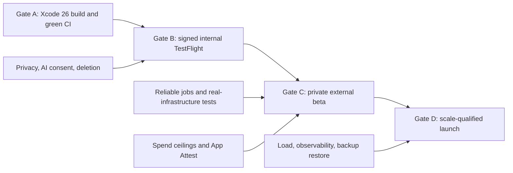

# Post-Sprint 1 diagnosis and completion plan

**Audit date:** July 12, 2026

**Audited revision:** `968e31b` on `codex/ios-sprint-1`

**Recommended next release target:** internal TestFlight beta

## July 12 Sprint 2 implementation update

The working tree now includes the next core-loop increment:

- local Ollama is the default structured itinerary composer, behind a
  provider-neutral boundary that keeps a hosted migration possible;
- destination and home base use explicit Apple Maps search/map selection and
  confirmation instead of independent free-text city/country fields;
- trip dates use one range control: the first tap selects arrival, the second
  selects departure, and a third tap restarts the range;
- Xcode 26.6 Debug tests pass on an iOS 26.5 simulator (14 tests), the Release
  simulator build passes with an injected HTTPS API URL, and XcodeGen output is
  deterministic in the current worktree;
- backend lint, OpenAPI drift, configuration parsing, and 74 tests pass.

This closes the stale-coordinate/map-selection portion of NXT-006 and the
simulator-build portion of NXT-001. It does not close either ticket: physical
device/CI evidence, semantic grounding validation, a seven-day beta decision,
and deterministic UI tests are still outstanding. Local Ollama also is not the
scale target; production inference capacity, quality, retries, observability,
and cost ceilings remain release-gated work.

## Executive decision

Sprint 1 established a credible foundation: server-issued guest identity,
owner-scoped data, request idempotency, a transactional outbox, leased workers,
a resilient Swift API client, pending-job recovery, a checked-in API contract,
and CI definitions.

The product is still a development beta. It is not ready for App Store review,
an open TestFlight, or the documented 100,000-MAU capacity envelope. The next
milestone should be a small internal TestFlight with a deliberately narrow,
measurable product scope. Public distribution and scale qualification should
remain blocked until privacy, deletion, generation reliability, spend control,
and real-infrastructure tests are complete.

## Verified current state

| Area | What was verified | Current status |
|---|---|---|
| Backend | Ruff, OpenAPI drift check, and 57 tests pass locally | Green, but tests are mostly mock-based |
| Backend coverage | 74% overall; database repository 44%; production trend and maps paths 50% and 66% | Critical infrastructure paths need integration coverage |
| iOS static checks | All app/test Swift files parse; the core client passes strict-concurrency type checking | Green |
| Native build | The machine has only `/Library/Developer/CommandLineTools`; `xcodebuild` cannot run | Unverified blocker |
| CI | Workflow includes Debug, Release, and XCTest simulator jobs | Branch has no upstream and no observed CI result for this revision |
| Distribution | No asset catalog/AppIcon, signing configuration, device archive, export, or TestFlight path | Not started |
| Product | Create, list, status, stream, and render exist | Routing, refinement, sharing, account/data deletion, and offline completed trips are absent |
| Production | Render topology exists; no staging smoke, load test, restore drill, alert set, or provider canary is recorded | Unproven |

## Important contract contradictions

These are specification failures, not optional polish.

1. The capacity contract allows a five-minute burst of five submissions per
   second, or 1,500 jobs. The configured global limiter allows only 1,000 jobs
   per hour, so at least 500 otherwise healthy burst requests would be rejected.
2. The deployment declares four worker slots. Sustaining five jobs per second
   with four slots would require a measured average service time below 0.8
   seconds; the current multi-provider and LLM pipeline has not demonstrated
   that.
3. The SLO says 98% of accepted jobs should finish within 120 seconds. The
   outbox can republish a still-pending job after five minutes, while a job
   claimed by a lost worker cannot be reclaimed until its one-hour lease
   expires.
4. The contract says duplicate paid generations caused by retries are zero,
   but the paid model call happens before its result is committed. A crash in
   that gap can charge for the same job again.
5. The cost contract says every job records tokens, provider calls, cache hits,
   and estimated cost. `AgentRun` exists but is unused, and those values are not
   recorded or enforced.
6. The README calls output provenance-tagged, but provider provenance is
   discarded before the final itinerary is stored and displayed.
7. Version 1 promises Apple Maps routing, refinement, sharing, and data
   deletion; there are no corresponding API routes or app flows.

## Recommended external-beta scope decision

Approve a coherent external-beta scope before adding more screens. The
recommended scope is:

- one- through seven-day trips;
- explicit accommodation search result selection and map confirmation;
- recoverable generation with safe progress and failure states;
- saved itineraries that remain readable offline;
- grounded activity details with an “Open in Apple Maps” action;
- privacy/AI disclosure and consent before the first generation;
- Settings, support/privacy links, and complete account/data deletion.

Seven days is a recommended initial cap, not a permanent product limit. The
current 30-day limit conflicts with a 30-segment day picker, a 16,000-token
output ceiling, response size, cost control, and factual-quality testing.
Longer trips should return only after the day selector, generation strategy,
and cost model are redesigned.

Defer refinement, public sharing, collaboration, social features, and
multi-region writes until the core loop is reliable. If refinement or sharing
must remain Version 1 promises, they need their own API revisions, authorization
model, UI tests, and release gate before marketing begins.

## Release gate sequence

No later gate should be started by weakening an earlier gate. A smaller beta
audience is the correct response when a gate is incomplete.

## P0 completion backlog

### NXT-001 — Prove the native build

**Owner:** iOS/platform

**Gate:** A

Install and select Xcode 26, regenerate the project, and run the shared scheme
on an iOS 17 minimum simulator plus a current iOS 26 simulator. Add deterministic
`#Preview` fixtures for the form, loading, failure, result, saved, and offline
states so UI work no longer requires a live backend.

**Acceptance criteria**

- A clean clone generates the same Xcode project and builds with Xcode 26.
- Debug, Release, XCTest, and a physical-device smoke test pass.
- The current branch is pushed and its complete GitHub workflow is green.
- A UI-test target launches against a deterministic stub API.

### NXT-002 — Establish a real staging environment

**Owner:** backend/platform

**Gate:** A

Deploy an HTTPS staging API, Postgres, Redis/broker, worker, and dispatcher.
Validate configuration by process role before accepting traffic. `/readyz`
must verify Postgres, required Redis/admission control, migration state, and
role-appropriate configuration instead of returning a constant response.

Before staging is considered ready, replace the separate Redis `INCR` and
`EXPIRE` limiter operations with an atomic script or token bucket and set
bounded Redis connect/socket timeouts. A failure between the current operations
can leave a global limiter key without an expiry.

**Acceptance criteria**

- Invalid production provider/model/secret configuration prevents promotion.
- An isolated deterministic smoke configuration traverses API, outbox, broker,
  worker, and database and reaches a terminal state; guards prove synthetic
  providers cannot be enabled in production.
- A separate production-like deployment validates all required configuration
  before receiving traffic.
- A separate provider canary verifies real credentials without using customer
  data or exceeding a defined budget.
- Release builds receive the staging/production URL through reviewed build
  configuration, never a source-code hostname.
- Concurrent limiter tests prove every limiter key has a positive TTL under
  injected Redis failures.

### NXT-003 — Create a distributable iOS artifact

**Owner:** iOS/release

**Gate:** B

Add `Assets.xcassets`, a complete AppIcon, launch branding, non-secret
`.xcconfig` files, bundle/team/signing settings, entitlements, version/build
automation, archive/export configuration, and dSYM retention. Pin the CI Xcode
version and verify the XcodeGen download checksum.

**Acceptance criteria**

- A Release device archive built with Xcode 26 passes App Store validation.
- The same archived artifact can be promoted to internal TestFlight.
- Marketing version and bundle version resolve consistently from build
  settings; no plist hard-coded version disagrees with `project.yml`.
- App icon, export-compliance answer, age-rating questionnaire, screenshots,
  support URL, and review contact checklist have assigned owners.

### NXT-004 — Add third-party AI disclosure and privacy controls

**Owner:** product/iOS/backend/legal

**Gate:** B

The current prompt sends accommodation address and coordinates, dates, group
size, food preferences, and free-form requests to Anthropic. Before the first
generation, show versioned disclosure that names the third-party AI provider,
describes the transmitted data categories and purpose, and requires explicit
permission. Minimize the transmitted data where possible.

Add an in-app Settings screen with privacy policy, support, terms, AI data-use,
consent withdrawal, and deletion entry points. Produce and validate
`PrivacyInfo.xcprivacy`, an Xcode privacy report, App Store privacy answers, and
public privacy/support URLs.

**Acceptance criteria**

- No third-party AI request can occur before recorded consent.
- Consent version/time and withdrawal are auditable without logging trip data.
- Privacy copy documents subprocessors, retention, deletion, and support.
- Privacy policy is reachable inside the app and in App Store Connect.

### NXT-005 — Implement account/data deletion and retention

**Owner:** backend/iOS/product

**Gate:** B for implementation; C for verified operation

Add an authenticated “Delete My Data” flow. It must revoke the refresh-token
family, prevent new work, cancel or safely finish in-flight work according to a
documented policy, remove owned itineraries and agent/provider records, clear
pending outbox data, and clear Keychain plus local caches. Define retention for
trip requests/results, expired refresh tokens, outbox rows, abandoned guest
users, failures, logs, and cost records.

**Acceptance criteria**

- The flow is easy to find, confirms destructive intent, and reports completion
  or a documented completion window.
- Integration and UI tests prove the old token is unusable, related database
  records are gone or legally retained under a documented exception, and all
  local data is cleared.
- A scheduled, monitored cleanup task enforces each retention period.

### NXT-006 — Close core product correctness gaps

**Owner:** iOS/backend/product

**Gate:** B

Invalidate accommodation selection whenever its query, city, or country
changes; make MapKit search cancellable; and require explicit result selection.
Cap the initial beta at seven days or redesign the day selector and generation
strategy before supporting longer trips.

Persist provider place ID, source, retrieval timestamp, and verification state
on every activity. Validate that generated activities use supported places,
plausible coordinates, ordered/valid days, bounded strings/lists, and stable
IDs. Show safe public errors, AI/freshness guidance, and an “Open in Apple Maps”
action. Keep raw provider exceptions in private telemetry only.

Define a minimum verified-place threshold. Skip isolated Apple Maps misses and
continue with enough geographically plausible results; below that threshold,
fail with a safe degraded-provider outcome instead of inventing locations or
aborting on the first miss.

**Acceptance criteria**

- Editing destination fields can never submit stale coordinates.
- A golden destination set meets a product-approved grounding and factual
  accuracy threshold.
- Unsupported places/coordinates are rejected or visibly marked unverified.
- One malformed itinerary cannot blank the saved-trip library.

### NXT-007 — Make job execution bounded and recoverable

**Owner:** backend/platform

**Gate:** C

Classify provider errors as transient or permanent; honor `Retry-After`; add
jittered retry budgets, stage/task deadlines, an attempt cap, and dead-letter
handling.

Persist stage checkpoints and a provider-call ledger before/after expensive
operations. Use provider idempotency where available. Where an external API
cannot make billing exactly once, define and enforce a bounded duplicate-cost
SLO instead of claiming an impossible guarantee.

**Acceptance criteria**

- After failed dependencies are restored, killing API, dispatcher, broker, or
  worker at each pipeline boundary recovers to exactly one terminal itinerary
  within the approved SLO, while provider-call counts remain inside the
  duplicate-cost SLO.
- A hang cannot outlive its task/lease budget; attempts are capped.
- Timeout, `429`, `5xx`, invalid payload, and permanent-error tests produce
  stable public error codes and bounded cost.
- Already-enqueued pending jobs are not repeatedly republished merely because
  the queue is backlogged. Broker visibility timeout, enqueue state, job lease,
  and redispatch timing are aligned and fault-tested.

### NXT-008 — Enforce cost and abuse ceilings

**Owner:** backend/product/security

**Gate:** C

Record model and prompt version, input/output tokens, provider calls, latency,
cache hits, retries, and estimated cost for 100% of jobs. Enforce per-job,
per-principal/per-device, and atomic global daily dollar ceilings with alerts
and an emergency kill switch.

Add App Attest enrollment, one-time server challenges, attestation verification,
assertions on paid-generation requests, counter/replay protection, and a
stricter fallback policy for unsupported devices. Trust only the hosting
platform’s authoritative proxy headers.

Also add total request-body limits, appropriate refresh/read endpoint limits,
per-principal SSE connection caps, keepalive/idle limits, and forwarded-header
spoofing tests. App Attest protects costly app actions; it does not replace
general API admission control.

**Acceptance criteria**

- Alerts fire at approved warning thresholds and admission closes at the hard
  daily ceiling.
- Kill-switch and budget behavior are exercised in staging.
- Scripted guest rotation cannot exceed the approved device/account budget.
- App Attest development, TestFlight, unsupported-device, and replay cases pass.

### NXT-009 — Test against real infrastructure and failure modes

**Owner:** backend/iOS/platform

**Gate:** C

Required CI must start real Postgres, Redis, Celery, and the dispatcher with
deterministic providers. Add online migration, concurrent idempotency, refresh
rotation, outbox race, broker loss, worker kill, lease expiry, SSE reconnect,
cleanup/deletion, and concurrent refresh-rotation tests. Lost refresh-response
recovery must be one-time and deterministic; repeatedly presenting the old
token during its grace window must not continually revoke newer replacements.
Add XCUITest for create, kill, offline relaunch, resume, success, auth recovery,
and deletion.

**Acceptance criteria**

- Mock-only tests remain fast, but release gates run on real service semantics.
- A failed infrastructure test cannot be bypassed when promoting a build.
- Coverage thresholds focus on repository, provider, worker, and auth failure
  paths rather than only an aggregate percentage.

## P1 completion backlog

Complete these before a broad external beta or scale qualification.

| ID | Work | Acceptance summary |
|---|---|---|
| NXT-010 | Split saved-trip summaries from full details; add stable cursor pagination | 1,000 trips page exactly once; bounded list payload; details load lazily |
| NXT-011 | Add a versioned offline cache for completed trips | Cold airplane-mode launch shows recent full itineraries; deletion purges cache |
| NXT-012 | Consume authenticated SSE with reconnect and polling fallback | One watcher per job; heartbeat/reconnect tested; traffic stays inside API budget |
| NXT-013 | Add identity recovery and optional Sign in with Apple linking | A rejected refresh never silently abandons trips; guest data links without loss; retry-grace rotation is one-time and deterministic |
| NXT-014 | Generate or contract-test Swift models from OpenAPI | Additive compatibility policy; unknown enums do not break the whole list |
| NXT-015 | Add privacy-safe observability and support correlation | API/worker/mobile traces, queue/job/provider/cost metrics, crash data, dashboards, alerts, runbooks |
| NXT-016 | Complete accessibility and localization gates | VoiceOver, Dynamic Type, reduced motion, contrast, small-screen CI, localized dates/strings |
| NXT-017 | Cache and parallelize provider work within quotas | Place/trend cache is used; bounded concurrency, freshness, hit rate, and quota metrics are proven |
| NXT-018 | Budget database connections and data growth | Per-role pool budgets, timeouts, cleanup, and production-plan capacity test pass |
| NXT-019 | Exercise backup, restore, and rollback | Agreed RPO/RTO demonstrated in staging; expand/migrate/contract policy documented |
| NXT-020 | Create a product quality/support loop | Privacy-safe funnel, crash-free sessions, inaccurate-place reporting, support SLA, build dashboard |
| NXT-021 | Harden the software supply chain | Runtime dependencies and base images are pinned; CI produces an SBOM and runs secret, dependency, and container vulnerability scans |

## Scale qualification gate

Do not claim the 100,000-MAU envelope until all of the following are recorded
as reproducible test artifacts:

- 1,000 non-generation requests per second and 10 job submissions per second
  for five minutes with deterministic fake providers;
- a 60-minute expected-peak soak with stable database connections, memory,
  queue age, error rate, and latency;
- separate contracted-provider quota, timeout, and cost tests;
- autoscaling driven by queue age and measured generation service time;
- 2,000 authenticated SSE connections, or a polling design proven to remain
  inside the read budget;
- a point-in-time restore and an application rollback without schema/data loss;
- dashboards and alerts that measure every published SLO and spend ceiling.

If those tests fail on the proposed infrastructure, either resize the system or
reduce the published launch envelope. Do not hide the mismatch behind a higher
rate-limit value.

## P2 work after measured demand

- Partition or archive large itinerary, outbox, refresh-token, and provider-call
  tables only after observed growth justifies it.
- Move large revision documents to compressed/object storage only after database
  I/O is a measured bottleneck.
- Add asymmetric JWT signing with `kid` rotation.
- Introduce provider-specific/priority queues and regional read replicas only
  when queue and database metrics justify them.
- Keep the repository native-only so obsolete browser clients cannot drift,
  expose old integrations, or confuse the production path.
- Keep the modular monolith; do not split services or add multi-region writes
  without measured need.

## Recommended Sprint 2 exit criteria

Sprint 2 should finish at Gate B, not attempt scale qualification. It is done
when:

- [ ] Xcode 26 builds/tests the app locally and in CI.
- [ ] Deterministic previews and a basic UI-test target exist.
- [ ] An HTTPS staging stack completes a synthetic end-to-end generation.
- [ ] A signed internal TestFlight build installs on a physical iPhone.
- [ ] The beta scope is formally narrowed and the trip-length/UI contract agree.
- [ ] AI disclosure and explicit consent occur before any third-party AI call.
- [ ] App icon, privacy manifest/report, privacy/support links, and Settings exist.
- [ ] Account/data deletion works end to end.
- [ ] Accommodation selection, output grounding, and public error handling pass
      their acceptance tests.

Generation resilience, cost ledgers, App Attest, real-infrastructure failure
tests, offline completed trips, and load/restore qualification then form the
Gate C sprint. If only one engineer is available, split Gate B across two
sprints rather than removing acceptance criteria.

## Current Apple references

These requirements were checked against official Apple material on the audit
date and should be rechecked before submission:

- [App Review Guidelines](https://developer.apple.com/app-store/review/guidelines/)
  — privacy policy in-app and in metadata; disclosure and explicit permission
  before sharing personal data with third-party AI.
- [Offering account deletion in your app](https://developer.apple.com/support/offering-account-deletion-in-your-app/)
  — apps supporting account creation must let users initiate complete deletion.
- [Manage app privacy](https://developer.apple.com/help/app-store-connect/manage-app-information/manage-app-privacy)
  — privacy policy URL and accurate App Privacy responses.
- [Privacy manifest files](https://developer.apple.com/documentation/bundleresources/privacy-manifest-files)
  — collected-data and required-reason API declarations.
- [Validating apps that connect to your server](https://developer.apple.com/documentation/devicecheck/validating-apps-that-connect-to-your-server)
  — App Attest server challenge, attestation, and assertion validation.
- [Configuring your app icon](https://developer.apple.com/documentation/xcode/configuring-your-app-icon/)
  — asset catalog and App Store icon.
- [Upcoming requirements](https://developer.apple.com/news/upcoming-requirements/)
  — since April 28, 2026, uploads require Xcode 26 or later and the iOS 26 SDK
  or later.
- [App Store platform version information](https://developer.apple.com/help/app-store-connect/reference/app-information/platform-version-information/)
  — screenshots, description, support URL, and review information.
