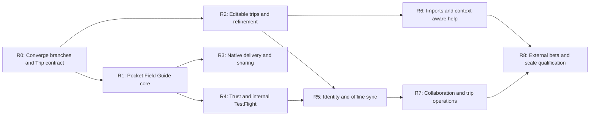

# Itinera product and engineering roadmap

**Roadmap date:** July 12, 2026
**Committed baseline:** `85d80cd` (`main`)
**Product direction:** Pocket Field Guide
**Next distribution target:** internal TestFlight

## Executive recommendation

Itinera should become the traveler's calm, dependable field guide rather than
another one-shot itinerary generator. The core promise is:

> Your plan is useful before the trip, dependable without a connection, and
> adaptable when the day changes.

The highest-priority work is not another standalone feature. It is converging
the parallel feature branches on one durable Trip contract with stable stop
identities, versioned revisions, owner-scoped mutations, and an offline
snapshot. Offline packs, Today mode, refinement, progress, widgets, and
collaboration all depend on that foundation.

Do not place all planned concepts into one speculative migration. Land the
minimum Trip/revision/stop contract first, then add reservations, checklists,
expenses, and collaboration through separate additive migrations when their
vertical slices are ready.

## What is already implemented

These capabilities are present at the committed baseline and must not be
scheduled again:

- native iOS 17+ SwiftUI application with the Atlas visual system and app icon;
- map-backed destination and home-base search, map tapping, reverse geocoding,
  and explicit confirmation;
- a unified two-tap trip-date range with DST-safe calendar handling;
- preferences for party size, wake time, budget, food, and must-do activities;
- guest authentication, rotating refresh credentials in Keychain, ownership,
  and idempotent generation submission;
- PostgreSQL source of truth, transactional outbox, Celery workers, leases,
  Redis coordination, and recoverable pending jobs;
- a provider-neutral structured composer with local Ollama by default,
  optional Anthropic, exact day coverage, and grounded activity validation;
- saved trips and relaunch-safe pending submission recovery;
- a privacy-reviewed Popular itinerary catalog with searchable destinations,
  lazy detail loading, and private saved snapshots;
- day maps, activity detail, Apple Maps stop handoff, and segmented Google Maps
  multi-stop route export;
- checked-in OpenAPI, deterministic XcodeGen, backend CI, and iOS Debug/Release
  simulator CI.

The last verified committed baseline had 88 backend tests and 21 iOS unit
tests passing. Re-run the full suite after the active work is integrated.

## Full iOS product sprint status

The `codex/full-ios-product` branch now contains an integrated implementation
of the following foundations. They are validated in the working tree but are
not a public-release claim until the sprint is intentionally committed,
reviewed, signed, and exercised on TestFlight.

| Workstream | Implemented evidence | Remaining release boundary |
|---|---|---|
| Real Apple Maps travel legs | `DayRoutePlanner`, mode selection, MapKit geometry/ETAs, and visible fallback | Physical-device throttling and accessibility QA |
| Offline/Today/progress/library | Protected cache, destination-time-zone Today mode, progress, search/groups, Archive lifecycle | Queued offline writes and conflict sync are later work |
| Settings and identity | Appearance, versioned AI consent, notification/storage controls, deletion, Sign in with Apple recovery | Publish privacy/support URLs and configure Apple client ID |
| Native delivery surfaces | Local notifications/reminders, Calendar, text/PDF share, App Group next-stop widget, and WidgetKit Live Activity extension | APNs remote delivery |
| Trip lifecycle controls | Owner-scoped rename/archive/restore/duplicate/delete with additive migration | Cursor pagination for very large libraries |
| Editable itineraries | Stable activity IDs, optimistic versions, revision history, manual operations, locks, weather-aware quick adjustments, and undo | Model-driven proposal/diff flow for selective AI regeneration |
| Practical trip tools | Place details, reservations, checklist, expenses, collaborator links, and place reports | Licensed fact enrichment/freshness policy and real-time collaboration conflicts |

The current integrated working tree is verified by 123 backend tests and 70
iOS tests, plus a Release simulator build of the app and widget. Treat a
capability as shipped only after it has an intentional commit, migration/API
evidence where applicable, signed Release archive, and the distribution checks
below.

### Current R0/R1 hardening checkpoint

This sprint closed several correctness gaps at the Trip-contract and Offline
Today boundary:

- stop IDs are deterministic within a trip and unique per day/occurrence;
  copied trips and Popular saves receive fresh IDs instead of sharing the
  source trip's stop identity;
- completed generation caches the authoritative saved-trip record when the
  server is reachable and retains a safe polled-result fallback when it is not;
- accepted editor revisions update the protected offline snapshot and the
  published in-app library together;
- archived trips remain downloaded and retain progress, but are hidden from
  the active library until restored;
- legacy saved-trip, job-status, and queued-generation JSON continues decoding
  after the schema additions;
- Delete My Data attempts every local cleanup independently, including trip
  packs, progress, pending work, form drafts, locked stops, and generation and
  reminder notifications;
- scheduled activity time is labeled `Starts at`; Itinera does not call it a
  leave-by time until a route-derived ETA exists.

This checkpoint does **not** close R0. The next contract work remains
principal-scoped offline storage, stop-ID-based revision operations with
idempotent mutation IDs, cursor pagination, migration backfills, and explicit
pending/running deletion semantics. True background completion notifications
also require the APNs delivery slice in R3.

## Product principles

1. **Offline content, online enhancement.** Itinerary text, stop data, notes,
   progress, and essential references work offline. Live routes, traffic,
   closures, and newly fetched place facts degrade clearly when unavailable.
2. **Traveler intent is durable.** Manual edits and locked stops are never
   silently overwritten by AI.
3. **AI proposes; the traveler approves.** Refinement produces a readable diff
   and a new revision, with undo available.
4. **Current facts need provenance.** Hours, closures, weather, price, and route
   data carry source, retrieval time, confidence, and freshness.
5. **One local source of truth.** Today mode, widgets, Live Activities, offline
   views, and notifications consume a small versioned device snapshot rather
   than each inventing separate state.
6. **Private by default.** Generated trips, accommodation details, notes,
   documents, and collaborators remain owner-scoped unless explicitly shared.
7. **Measure before decomposing.** Keep the modular monolith and independently
   scalable API/worker processes until profiling justifies service extraction.

## Required domain contract

Before the active product surfaces expand, settle the following additive
contract:

### Trip aggregate

- `trip_id`: stable user-facing identity, separate from generation job ID;
- owner, title, destination, destination time zone, date range, lifecycle
  (`upcoming`, `active`, `past`, `archived`, `deleting`), and active revision;
- source (`generated`, `popular_snapshot`, `duplicated`, `imported`);
- server version/ETag, created/updated timestamps, and soft-deletion tombstone;
- generation status remains a related concern, not the trip lifecycle.

### Immutable revision

- revision number, parent revision, origin (`generation`, `manual`, `AI`,
  `import`, `conflict_resolution`), actor, prompt/model version when relevant;
- complete JSON snapshot initially; full relational normalization is not
  required yet;
- operations target stable day and stop IDs, never array indexes;
- locked stop IDs and a user-visible summary of changes;
- optimistic concurrency through `base_revision` or `If-Match`.

### Stable stop and place snapshot

- server-issued `stop_id` that survives reorder, completion, and refinement;
- provider place ID, provider/source, coordinates, canonical address,
  retrieved-at time, and verification state;
- optional hours, phone, URLs, cost/accessibility notes, and their freshness;
- stop schedule stored as local date/time plus IANA destination time zone;
- progress state (`planned`, `done`, `skipped`, `postponed`) is mutable state
  separate from structural itinerary revisions.

### Offline and sync contract

- schema-versioned local store with atomic migrations;
- full trip detail cached on successful fetch and generation completion;
- mutation IDs, an ordered pending-operation queue, opaque server change
  cursor, and deletion tombstones;
- conflict policy: merge independent metadata/progress changes; preserve both
  revisions for structural conflicts and ask the traveler to resolve them;
- one minimal, versioned App Group snapshot for widgets and Live Activities.

## Sequenced roadmap

### R0 — Converge active work and establish the Trip contract

**Goal:** prevent parallel UI and backend work from creating incompatible data
models.

**Scope**

- inventory every active branch and assign a single owner per overlapping file;
- split route, Settings, domain, CI, and library work into focused PRs;
- add Trip identity, version, title/archive lifecycle, immutable revisions,
  stable stop IDs, place snapshots, and optimistic concurrency;
- backfill generated trips and Popular saved snapshots without changing their
  existing job IDs or ownership;
- replace the server's fixed 50-item full-result library response with
  cursor-paginated summaries and lazy detail retrieval;
- regenerate OpenAPI and Swift models from the accepted contract;
- defer reservation/checklist/expense/collaboration tables until their own
  vertical slices.

**Acceptance criteria**

- existing guest installs, job URLs, pending jobs, and Popular saves continue
  to work after migration;
- every persisted stop has a stable ID and mutation APIs never use array index
  as identity;
- a stale mutation returns a typed `409`/revision conflict without overwriting
  the current trip;
- 1,000 trips paginate without duplicates and without downloading every full
  itinerary;
- migration upgrade, backfill, downgrade strategy, OpenAPI drift, backend tests,
  iOS tests, and a clean XcodeGen regeneration pass;
- all integrated branches end in a clean working tree with no orphaned drafts.

### R1 — Pocket Field Guide core (active product sprint)

**Goal:** make a completed trip dependable and useful during travel.

**Scope**

- offline trip packs containing full itinerary data, notes, place snapshots,
  and last-known route summaries;
- Today mode with destination-time-zone day selection, current/next stop,
  leave-by time, day progress, notes, and one-tap directions;
- adjacent live walking/transit/driving legs using `MKDirections`, cancellable
  requests, bounded concurrency, cache freshness, and straight-line fallback;
- library search, Upcoming/Active/Generating/Past/Archived groups, rename,
  duplicate, archive, delete, and storage/offline indicators;
- explicit Apple Maps handoff and guidance for downloading the destination in
  the Maps app.

**Acceptance criteria**

- after one successful download, a traveler can kill the app, enable airplane
  mode, reopen an active trip, read every stop/note, and launch available
  directions without data loss;
- do not promise programmatically downloaded map tiles: the product promise is
  offline trip content, while map/direction availability is reported honestly;
- Today mode selects the correct day across destination time zones and DST;
- route calculation cancels stale day/mode requests and handles MapKit
  throttling or provider failure without blanking the itinerary;
- destructive library actions are owner-scoped, confirm intent, update the
  local cache, and remain idempotent on retry;
- XCUITest covers active-trip launch, offline relaunch, directions, archive,
  and delete failure/retry.

### R2 — Editable trips and selective AI refinement (active following sprint)

**Goal:** let travelers shape a plan without regenerating or losing the whole
trip.

**Scope**

- manual add, remove, reorder, replace, reschedule, and undo first;
- done/skipped/postponed progress stored separately from structural revisions;
- lock/unlock stops and day-level constraints;
- AI operations: replace one stop, make a day lighter, change travel mode,
  regenerate one day, and rebalance remaining time;
- proposed-change preview showing additions, removals, timing/route effects,
  locked content, and cost before apply;
- revision history, restore, idempotent mutation IDs, and conflict handling;
- report inaccurate/closed places with a moderation state and safe traveler
  warning.

**Acceptance criteria**

- manual edits work without an AI provider;
- refinement never modifies another day or a locked stop unless the preview
  explicitly says so and the traveler approves;
- rejecting a proposal makes no revision; accepting creates exactly one new
  revision even after retry;
- undo restores the prior snapshot and stable stop IDs;
- all AI-added/replaced stops pass the same place grounding and freshness gates
  as initial generation;
- golden trips cover time zones, reorder, lock preservation, provider outage,
  conflict, and rollback.

### R3 — Native delivery, calendar, sharing, widgets, and Live Activity

**Goal:** put the right small piece of the trip where the traveler needs it.

**Sequence**

1. visible APNs generation-complete notification with owner-scoped deep link;
2. local leave-by reminders rebuilt after schedule/time-zone edits;
3. Calendar export and native text/PDF sharing;
4. Home/Lock Screen widget using a versioned App Group snapshot;
5. Live Activity only after Today mode and stop timing are stable.

**Scope and constraints**

- notification tokens/preferences, invalid-token cleanup, delivery ledger, and
  transactional outbox event; background/silent delivery is an enhancement,
  never the source of truth;
- use EventKit write-only access or `EKEventEditViewController`; warn that a
  one-way re-export may duplicate events until event-link tracking exists;
- create a dedicated paginated Atlas PDF with `UIGraphicsPDFRenderer`, export
  it and text through `ShareLink`, and avoid sharing guest API URLs;
- widget entries are precomputed, small, privacy-redacted, and deep-link into
  trip/day/stop;
- Live Activity contains current/next stop and leave-by time, stays below the
  platform payload limit, has a stale date, and ends after the travel day,
  deletion, or sign-out; it never reads location/network directly.

**Acceptance criteria**

- duplicate outbox deliveries yield at most one visible completion alert;
- notification denial, APNs failure, stale widget cache, and incompatible App
  Group versions degrade cleanly;
- no accommodation address, private note, or confirmation code appears on the
  Lock Screen by default;
- exported Calendar events use destination time zone and PDF pagination passes
  visual regression tests;
- widgets render useful cached content offline;
- Live Activity lifecycle tests cover start/update/stale/end and devices
  without Dynamic Island.

### R4 — Trust, privacy, and internal TestFlight

**Goal:** make the useful product safe and distributable to a small internal
group.

**Scope**

- complete Settings with privacy policy, support, terms, AI data-use,
  notification controls, cache/storage controls, export, and Delete My Data;
- versioned AI disclosure and explicit consent enforced by the backend before
  generation or refinement;
- deletion workflow that revokes refresh sessions, blocks new work, handles
  active jobs, removes trips/revisions/outbox/provider records/device tokens,
  and clears Keychain/local/App Group caches;
- retention jobs for abandoned guests, failures, refresh tokens, outbox rows,
  logs, generated content, and provider-call records;
- valid `PrivacyInfo.xcprivacy`, App Store privacy answers, public support and
  privacy URLs, accessibility audit, and AI/freshness guidance;
- signed device archive, version/build automation, dSYM retention, internal
  TestFlight workflow, and a small XCUITest target;
- real staging with role-aware `/readyz` checks for database, Redis, migration,
  queue, and required provider configuration.

**Acceptance criteria**

- no composer call occurs without current server-verified consent;
- deletion makes old tokens unusable and removes every documented server and
  device copy within the stated window;
- privacy manifest/report and App Store metadata match observed data flows;
- signed archive validates and installs through internal TestFlight;
- XCUITest covers create, background/kill, offline resume, success, auth
  refresh, settings, consent, and deletion;
- support can diagnose a failed request from a correlation ID without logging
  exact itinerary content.

### R5 — Sign in with Apple and bidirectional offline sync

**Goal:** preserve anonymous-first simplicity while enabling recovery and safe
multi-device use.

**Scope**

- link the current guest principal to Sign in with Apple without copying or
  duplicating trips;
- opaque change cursor, tombstones, mutation deduplication, and queued offline
  edits/progress/archive actions;
- deterministic merge of independent changes and explicit structural conflict
  resolution that preserves both revisions;
- local schema migrations, cache size policy, encryption/data-protection class,
  and recovery from corrupt/incompatible snapshots;
- delete/sign-out semantics across server, local store, pending queue, widget,
  Live Activity, and notification tokens.

**Acceptance criteria**

- guest-to-Apple linking retains every trip and invalidates replayed linking
  attempts;
- two devices converge after concurrent non-conflicting edits;
- conflicting structural edits never silently discard either revision;
- offline mutations synchronize exactly once after reconnect;
- deletion and sign-out leave no private content in extensions or pending sync;
- identity-link, refresh-loss, sync replay, tombstone, and migration tests run
  against real Postgres and Redis in CI.

### R6 — Trip essentials import and context-aware assistance

**Goal:** make the field guide aware of the travel facts that actually change
the day.

**Scope**

- reservation/document import from Files and the iOS Share Sheet first;
- parsing into a review screen before saving: lodging, flight/train, dining,
  tickets, confirmation references, attachments, and time zone;
- defer full mailbox access until privacy, provider review, revocation,
  deletion, support, and operational cost are approved;
- licensed adapters for opening hours/closures, weather, and transit
  disruption with source/freshness/confidence metadata;
- Trip Health panel showing stale place data, possible closures, timing
  conflicts, bad route feasibility, and weather risk;
- AI may propose a revision (for example, move an outdoor stop because of
  rain), but must show the cause/source and require approval;
- practical essentials card for lodging, booking references, critical notes,
  and documents, protected from Lock Screen exposure.

**Acceptance criteria**

- imported data is never committed before review and duplicate imports are
  detected;
- sensitive documents are encrypted/protected, excluded from logs, exportable,
  and deletable;
- stale or unavailable providers never become invented current facts;
- recommendations show what changed, why, source time, and confidence;
- locked stops remain unchanged and rejecting a recommendation leaves the
  active revision untouched;
- golden fixtures cover DST, overnight travel, multiple currencies, closures,
  rain, provider outage, and malformed documents.

### R7 — Collaboration, checklists, and expenses

**Goal:** expand only after identity, revisions, and sync are reliable.

**Scope**

- expiring invites, viewer/editor roles, membership revocation, audit history,
  and owner-only destructive actions;
- collaborative changes use the same revision/mutation contract rather than a
  separate real-time document model;
- preparation and packing checklists with templates, assignee, due date, and
  offline completion;
- expenses stored in integer minor units with ISO currency, payer/participants,
  category, receipt attachment, and settlement summary;
- optional exchange-rate snapshots are timestamped; never silently rewrite
  historical amounts;
- shareable read-only trip summary can precede full editor collaboration.

**Acceptance criteria**

- every collaboration endpoint proves membership and role authorization;
- revoked or expired invites cannot be replayed;
- concurrent edits create deterministic revisions/conflicts;
- offline checklist and expense mutations synchronize once;
- splits reconcile exactly in minor units and preserve original currency;
- deleting a user/trip follows the documented collaborator, expense, receipt,
  and audit-retention policy.

### R8 — External beta and scale qualification

**Goal:** prove the capacity, reliability, quality, and cost claims before an
open beta.

**Scope**

- real-infrastructure CI with Postgres, Redis, broker, dispatcher, and workers;
- atomic token-bucket admission control and bounded Redis timeouts;
- provider error classification, `Retry-After`, jittered retry budgets, stage
  deadlines, checkpoints, attempt caps, dead-letter handling, and safe public
  error codes;
- align broker visibility, worker lease, redispatch, and the terminal-job SLO;
- provider-call/cost ledger with model/prompt version, tokens, calls, latency,
  retries, cache hits, and estimated cost;
- App Attest challenge/assertion verification for costly actions, with a
  measured fallback for unsupported or failed devices;
- global spend ceiling, per-principal/device quotas, alerting, and emergency
  generation/refinement switch;
- privacy-safe API/worker/iOS traces, queue-age/provider dashboards, runbooks,
  restore drill, rollback drill, and additive migration rehearsal;
- deterministic-provider load and soak tests; separately canary real providers
  under a strict budget;
- select hosted inference or a private GPU pool from measured latency, quality,
  throughput, and cost. Desktop Ollama remains a development mode.

**Acceptance criteria**

- published API/job/queue/crash-free SLOs have dashboards and tested alerts;
- expected traffic and burst load pass without exhausting database connections
  or allowing queue age to escape its target;
- provider hangs, throttling, malformed output, and process kills reach bounded
  outcomes without multiple terminal revisions;
- duplicate external cost is measured and bounded rather than described as
  exactly once when the provider cannot guarantee it;
- point-in-time restore and application rollback meet approved RPO/RTO;
- a private external-beta cohort meets quality, latency, crash, deletion, and
  support targets for two consecutive weeks before expansion.

## Release gates

| Gate | Audience | Must be true |
|---|---|---|
| A — Integrated development build | Team/simulator | R0 contract merged; active branches reconciled; full backend/iOS suites green; no schema/OpenAPI/XcodeGen drift |
| B — Internal TestFlight | Internal testers | Offline trip detail; trust/privacy/deletion; signed archive; staging; core XCUITest; crash/error telemetry |
| C — Private external beta | Invited travelers | Editable revisions; place provenance/freshness; bounded jobs/cost; notifications; restore drill; support runbook |
| D — Public rollout | Staged percentage | Scale/soak evidence; App Attest and spend ceilings; privacy evidence; quality metrics; rollback plan |

## Metrics and decision thresholds

Instrument product events with opaque trip/stop identifiers and no addresses,
notes, confirmation codes, or prompt text.

### North-star and engagement

- **North-star:** percentage of active-trip days where the traveler opens Today
  mode and completes a useful action (directions, progress, note, or approved
  change).
- trip creation-to-first-save conversion;
- offline pack availability before departure and offline open success;
- Today mode opens per active day and directions handoff rate;
- refinement proposal acceptance, rejection, undo, and locked-stop violation
  rate;
- completion/skip/postpone usage;
- seven- and thirty-day return rate among travelers with another upcoming trip.

### Quality and trust

- grounded/verified activity percentage and stale-place warning rate;
- route/provider failure and fallback rate;
- itinerary edit rate before departure (signal of fit, not automatically bad);
- inaccurate/closed-place reports per 1,000 stops and median resolution time;
- generation/refinement failure rate and p50/p95 completion time;
- deletion completion success/time and privacy/consent error count;
- notification opt-in, delivery, deep-link success, and stale Live Activity rate.

### Reliability and scale

- crash-free sessions, cold-launch time, local-store migration failure, and
  offline read success;
- API p50/p95/p99, database pool saturation, oldest queue age, worker service
  time, retry count, and provider latency;
- cost per accepted/completed trip and refinement, daily spend, cache hit rate,
  and rejected-abuse volume;
- sync replay/conflict rate and time to convergence.

## Cross-cutting definition of done

Every feature sprint includes:

- additive migration and rollback/backfill plan when persistence changes;
- owner/role authorization tests and idempotency for every mutation;
- regenerated OpenAPI and matching Swift models;
- backend unit/behavior tests plus real-infrastructure coverage for critical
  state transitions;
- iOS unit tests, deterministic previews, at least one XCUITest for the main
  path, and offline/error/empty/loading states;
- VoiceOver, Dynamic Type, reduced motion, contrast, and small-screen review;
- destination time-zone and DST fixtures;
- privacy/data-flow review, retention/deletion behavior, and safe telemetry;
- feature flag/rollback plan for migrations, providers, and remote surfaces;
- documentation and measurable product/quality events.

## Explicit non-goals until the dependencies exist

- Do not promise app-managed offline Apple map downloads; cache trip content
  and let travelers use Maps' own offline-region feature where available.
- Do not build embedded turn-by-turn navigation; use route previews and Apple
  Maps handoff.
- Do not ship a Live Activity before Today mode, time-zone scheduling, and the
  App Group snapshot are reliable.
- Do not request mailbox access before Files/Share Sheet import proves demand.
- Do not build real-time collaboration before stable identity, revisions,
  optimistic concurrency, and offline sync.
- Do not merge speculative reservation/checklist/expense/collaboration tables
  merely because draft models exist.
- Do not expose private guest API URLs as sharing links.
- Do not use local desktop Ollama as the production capacity plan.
- Do not split the modular monolith without a measured bottleneck.

## Platform constraints and primary references

- `MKDirections` calculates routes and ETAs through Apple's service and may be
  throttled: <https://developer.apple.com/documentation/mapkit/mkdirections>
- Apple Maps offline regions are managed by the Maps app and vary by region:
  <https://support.apple.com/en-us/105084>
- ActivityKit and Live Activity push updates:
  <https://developer.apple.com/documentation/activitykit> and
  <https://developer.apple.com/documentation/activitykit/starting-and-updating-live-activities-with-activitykit-push-notifications>
- Widget/App Group strategy and privacy constraints:
  <https://developer.apple.com/documentation/widgetkit/developing-a-widgetkit-strategy>
- Background pushes are best effort and can be throttled:
  <https://developer.apple.com/documentation/usernotifications/pushing-background-updates-to-your-app>
- Calendar access and iOS 17 write-only/EventKit UI choices:
  <https://developer.apple.com/documentation/eventkit/accessing-calendar-using-eventkit-and-eventkitui>
- Native sharing and PDF generation:
  <https://developer.apple.com/documentation/swiftui/sharelink> and
  <https://developer.apple.com/documentation/uikit/uigraphicspdfrenderer>
- Privacy manifests, App Attest, and App Review account/deletion expectations:
  <https://developer.apple.com/documentation/bundleresources/privacy-manifest-files>,
  <https://developer.apple.com/documentation/devicecheck>, and
  <https://developer.apple.com/app-store/review/guidelines/>
- Market expectation references:
  <https://wanderlog.com/> and <https://www.tripit.com/web/free>

## Immediate next actions

1. Freeze new speculative tables until R0's Trip/revision/stop contract is
   reviewed.
2. Inventory the active branches and assign integration ownership for models,
   itinerary UI, Settings, routing, and Compose changes.
3. Write the R0 migration and API contract before extending the draft schemas.
4. Add server-issued stop IDs and replace index-based revision operations.
5. Split library summaries from trip detail and define cursor pagination.
6. Define the single offline/App Group trip snapshot consumed by Today,
   widgets, Live Activities, and cached detail.
7. Finish the real-route vertical slice with cancellation, cache, throttling,
   and fallback tests.
8. Turn Settings placeholders into a server-enforced consent/deletion slice,
   not local-only toggles.
9. Create a small XCUITest target before the UI surface count grows further.
10. Re-run the complete committed test/release matrix after branch convergence,
    then cut the internal TestFlight backlog from Gate B rather than starting
    another unrelated feature.
