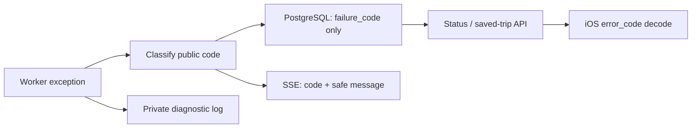

# Sprint P3 — Safe generation failures

**Started:** July 16, 2026  
**Status:** Locally validated; awaiting intentional review and integration  
**Scope:** Backend generation terminal-failure contract, iOS decoding compatibility,
database migration, and generated OpenAPI only.

## Problem and decision

A failed Celery generation job previously copied `str(exception)` into the
database and an SSE event. That value is returned by both job-status and saved
trip APIs, so provider responses, configuration names, or network diagnostics
could become user-visible and form an unstable mobile contract.

P3 replaces that path with a deliberately small public vocabulary:

| Code | Traveler message | Intended action |
|---|---|---|
| `generation_unavailable` | The planning service is temporarily unavailable. | Try again in a few minutes. |
| `generation_failed` | The itinerary could not be created. | Try again. |

The worker records the original exception only through private worker
diagnostics. It persists the stable code, never the exception text. The API
derives the public message from that code, so an old row with raw error text is
also rendered generically rather than disclosed.

## Data flow and compatibility

- Migration `4d0cdb7edcc4` adds nullable `itineraries.failure_code` and clears
  historic failed-row error text while backfilling `generation_failed`.
- `error_code` is additive in OpenAPI. Existing iOS builds continue to decode
  its absence; updated builds use the code when surfacing a terminal failure.
- Unknown, missing, or legacy codes fail closed to `generation_failed`.
- No retry policy, task deadline, provider idempotency, or cost ledger is
  implied by this change; those remain NXT-007/NXT-008 work.

## Acceptance evidence

- Focused backend tests passed: worker persistence/event behavior, legacy
  response sanitization for both status and saved trips, network
  classification, readiness lineage, and stream behavior (**54 passed**).
- Ruff passed for every changed backend, migration, and test file.
- The generated OpenAPI contract was refreshed.
- Alembic emitted the full PostgreSQL upgrade successfully; the migration is
  additive and has a straightforward column-removal downgrade.
- XcodeGen completed and the complete Debug simulator test run passed on
  iPhone 17 Pro / iOS 26.5.
- Full backend lint and test evidence is now green: Ruff passed and all
  **243 runnable tests passed** (16 real-infrastructure tests skipped locally).

## Outstanding verification and risks

- Full iOS tests/build, production-like migration execution, end-to-end worker
  diagnostics access controls, bounded task retries, and spend accounting
  remain required before release.
